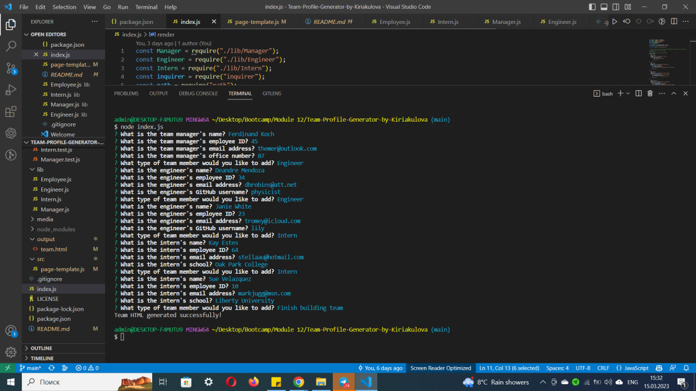
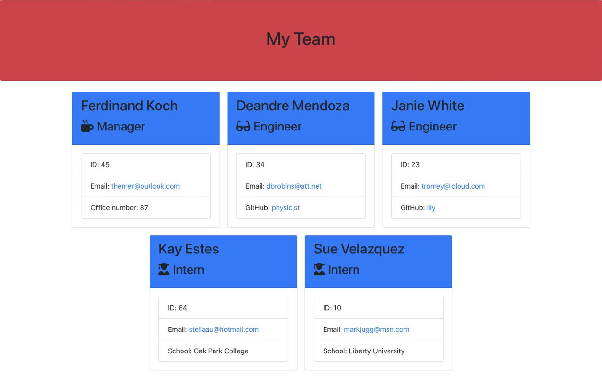

# Team-Profile-Generator-by-Kiriakulova
## Description
This is a command-line application that allows you to generate a team profile HTML page by answering a series of questions. The generated HTML file displays information about the team members such as their names, roles, email addresses, and GitHub profiles.

## Table of Contents
- [Installation](#installation)
- [Usage](#usage)
- [Contributing](#contributing)
- [Tests](#tests)
- [License](#license)
- [Questions](#questions)

## Installation
To use this application, you need to have [Node.js](https://nodejs.org/en/) installed on your computer.

1. Clone the repository to your local machine.
2. Open the command prompt and navigate to the root directory of the project.
3. Install the dependencies by running the command `npm install`.

## Usage
To run the application, open the command prompt and navigate to the root directory of the project. Then, run the command `node index.js`. Answer the prompts to generate the team profile HTML file.

The generated HTML file will be located in the `output` folder.

## Screenshots

## Contributing
Contributions to this project are welcome. If you would like to contribute, please submit a pull request.

## Tests
To run the tests for this application, navigate to the root directory of the project in the command prompt and run the command `npm run test`.

## Credits
This application was created by [@Maeevee](https://github.com/Maeevee) using [Stack Overflow](https://stackoverflow.com/), [ChatGPT](https://openai.com/blog/chatgpt/) [Bootstrap](https://getbootstrap.com/) and [Font Awesome](https://fontawesome.com/).

## License
This project is licensed under the terms of the MIT License.

## Questions
If you have any questions about this application, please contact me by email at maeevee@gmail.com. You can also find me on [GitHub](https://github.com/Maeevee).